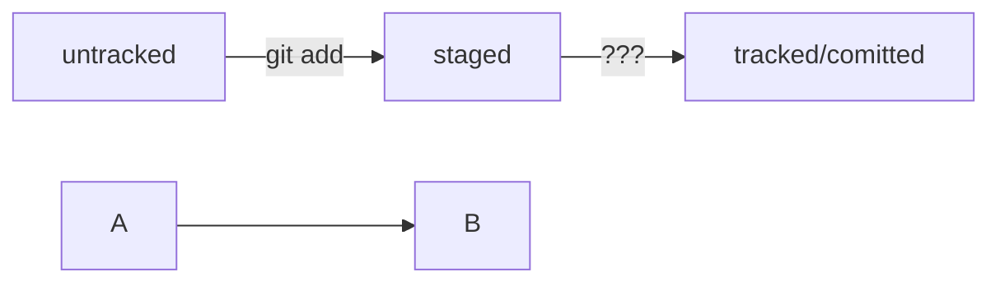

### Скрипт мониторинга ресурсов сервера

Логика работы:
1) Перебираем параметры введенные после вызова скрипта
    * На данный момент, реалезуем один аргумент -p и один дополнительный параметр
2) Каждый параметр отправляем в фунцию проверки параметров
    * Если есть доболнительные параметры учитываем это
3) После проверки аргументов вызывает соответствующую функцию
4) ...


# Здесь шпаргалка по  
---
# Шпаргалка markdown

## Выделение текста

Вы можете выделять текст в markdown с помощью символов `_` или `*`. Например:

Пример _курсива_ и **жирного** текста.

## Заголовки

Заголовки можно создавать с помощью символа `#`. Чем больше `#`, тем меньше заголовок. Например:

# Заголовок первого уровня
## Заголовок второго уровня
### Заголовок третьего уровня

## Выделение кода

Чтобы выделить текст как код, поместите его в тройные кавычки `````. 

```
mkdir my_project
cd my_project
git init
```
Это лишь некоторые функции markdown. 

HEAD -- это голова.
Коммит -- это всему голова.
Статусы файлов:
<тут пустая строка!>
```mermaid
%% описание схемы
```
<и тут пустая строка!> 


--- 
Последний коммит имеет статус в логе HEAD, так проще понять что этот коммит последний
---
